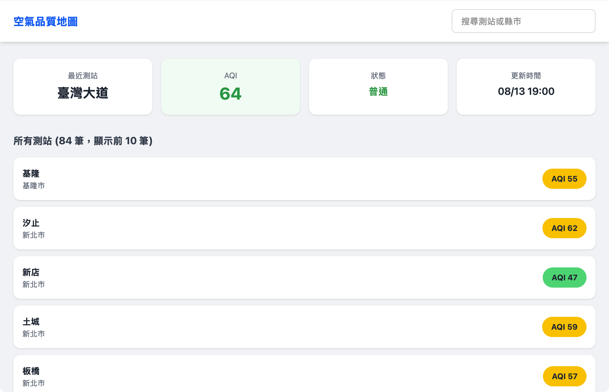

# 台灣空氣品質即時地圖

即時顯示全台灣測站的空氣品質指標（AQI），結合 GPS 定位找出最近測站，並以顏色分級呈現空氣品質狀態。

## 功能

- **GPS 定位**：自動偵測使用者位置，顯示最近測站的 AQI、狀態與更新時間
- **互動地圖**：以 Leaflet 地圖標示全台測站，AQI 以顏色圓點呈現
- **搜尋過濾**：輸入測站名稱或縣市，即時過濾測站列表與地圖標記
- **AQI 色彩分級**：依環保署標準，6 級顏色對應空氣品質良好至危險

## 截圖



## 技術棧

- React 19
- Vite
- Tailwind CSS 4
- Leaflet / React-Leaflet
- 環保署開放資料 API

## 開發

```bash
npm install
npm run dev
```

## 資料來源

- [環境部開放資料平台 — AQI](https://data.moenv.gov.tw/)
